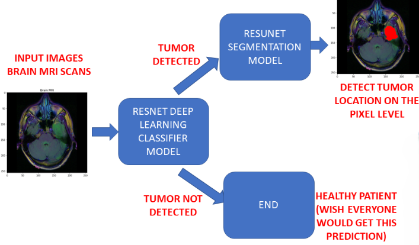
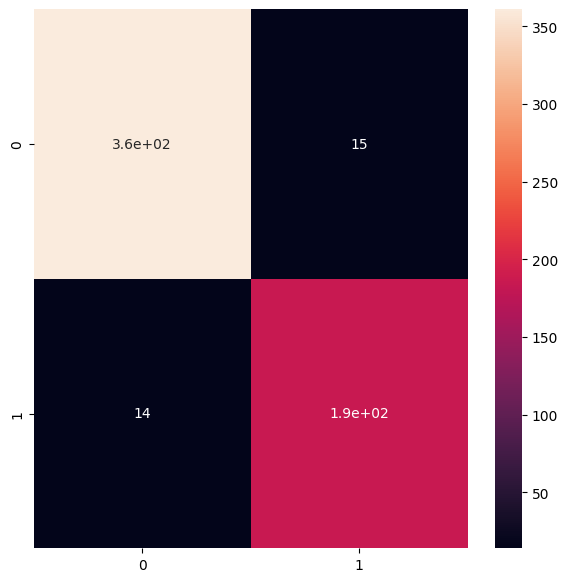
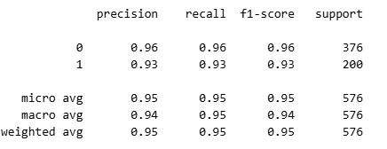
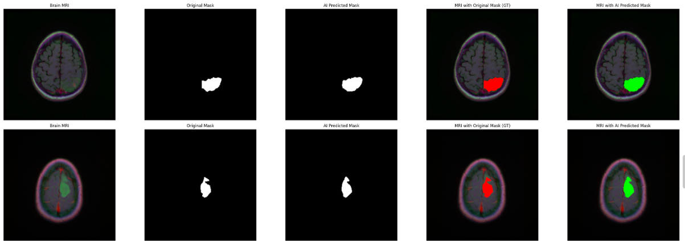

# 🧠 MRI Brain Tumor Detection and Segmentation

A two-stage deep learning pipeline for automated brain tumor detection and precise localization from MRI scans using ResNet50 and ResUNet architectures.

---

## 📋 Overview

This project implements an intelligent medical imaging system that:

1. **Detects** whether a brain tumor is present in an MRI scan using a modified **ResNet50** classifier
2. **Segments** and **localizes** the tumor region using a **ResUNet** model (only if tumor is detected)

The two-stage approach ensures computational efficiency—segmentation is performed only when necessary, making it suitable for real-world clinical workflows.

---

## 📂 Project Structure

```
.
├── ResUNet-model.json          # ResUNet model architecture
├── resnet-50-MRI.json          # ResNet50 model architecture
├── solution.ipynb              # Main Jupyter notebook
├── utilities.py                # Helper functions
└── docs/
    ├── Workflow.png            # System workflow diagram
    ├── confusion_matrix.png    # ResNet50 confusion matrix
    ├── Classiffication_report.png  # ResNet50 classification metrics
    └── prediction.png          # ResUNet segmentation output
```

---

## 🔄 System Workflow

The diagram below illustrates the complete detection and segmentation pipeline:

<p align="center">
  
</p>

**Process Flow:**
1. Input MRI scan is preprocessed and normalized
2. ResNet50 classifies the scan as **Tumor** or **No Tumor**
3. If **No Tumor**: Process terminates with negative result
4. If **Tumor Detected**: ResUNet segments the tumor region
5. Output displays the segmented tumor mask overlaid on the original MRI

---

## 🔍 Stage 1: Tumor Detection (ResNet50)

A fine-tuned **ResNet50** model serves as the primary classifier, determining tumor presence with high accuracy.

### Model Architecture
- Base: ResNet50 (pre-trained on ImageNet)
- Modified top layers for binary classification
- Output: **Tumor Present** / **No Tumor**

### Performance Metrics

#### Confusion Matrix
<p align="center">
  
</p>

#### Classification Report
<p align="center">
  
</p>

The model achieves excellent performance in distinguishing between tumor and non-tumor cases, as evidenced by the metrics above.

---

## 🎯 Stage 2: Tumor Segmentation (ResUNet)

When a tumor is detected, the **ResUNet** model performs pixel-wise segmentation to precisely locate the tumor boundaries.

### Model Architecture
- Encoder-Decoder structure inspired by U-Net
- Residual connections for improved gradient flow
- Output: Binary segmentation mask highlighting tumor region

### Segmentation Results
<!-- <div align="center">
  <table style="border: none;">
    <tr>
      <td align="center" width="20%" style="border: none; padding: 10px;"><b>Brain MRI</b></td>
      <td align="center" width="20%" style="border: none; padding: 10px;"><b>Original Mask</b></td>
      <td align="center" width="20%" style="border: none; padding: 10px;"><b>Predicted Mask</b></td>
      <td align="center" width="20%" style="border: none; padding: 10px;"><b>MRI with Original Mask</b></td>
      <td align="center" width="20%" style="border: none; padding: 10px;"><b>MRI with Predicted Mask</b></td>
    </tr>
  </table>
</div> -->
**&nbsp;&nbsp;&nbsp;&nbsp;&nbsp;&nbsp;&nbsp;&nbsp;&nbsp;&nbsp;Brain MRI&nbsp;&nbsp;&nbsp;&nbsp;&nbsp;&nbsp;&nbsp;&nbsp;&nbsp;&nbsp;&nbsp;&nbsp;&nbsp;&nbsp;&nbsp;&nbsp;&nbsp;&nbsp;&nbsp;&nbsp;&nbsp;&nbsp;Original Mask&nbsp;&nbsp;&nbsp;&nbsp;&nbsp;&nbsp;&nbsp;&nbsp;&nbsp;&nbsp;&nbsp;&nbsp;&nbsp;&nbsp;&nbsp;&nbsp;&nbsp;&nbsp;&nbsp;&nbsp;Predicted Mask&nbsp;&nbsp;&nbsp;&nbsp;&nbsp;&nbsp;&nbsp;&nbsp;&nbsp;&nbsp;&nbsp;&nbsp;&nbsp;&nbsp;&nbsp;&nbsp;&nbsp;&nbsp;Groung Truth&nbsp;&nbsp;&nbsp;&nbsp;&nbsp;&nbsp;&nbsp;&nbsp;&nbsp;&nbsp;&nbsp;&nbsp;&nbsp;&nbsp;&nbsp;&nbsp;&nbsp;&nbsp;&nbsp;&nbsp;&nbsp;&nbsp;Prediction**

<p align="center">
  
</p>

The segmentation output shows the original MRI alongside the predicted tumor mask, enabling radiologists to quickly identify and analyze tumor location and extent.

---

## 🛠️ Technical Stack

- **Deep Learning Framework:** TensorFlow / Keras
- **Image Processing:** OpenCV, NumPy
- **Visualization:** Matplotlib, Seaborn
- **Metrics:** Scikit-learn

---

## 📦 Installation

### Prerequisites

Ensure you have Python 3.8+ installed, then install the required dependencies:

```bash
pip install tensorflow keras numpy pandas matplotlib scikit-learn opencv-python
```

### Setup

1. **Clone the repository:**
   ```bash
   git clone https://github.com/mithleshsingla/MRI_Brain_Tumor_detection_and_segmentaton.git
   cd mri-tumor-detection
   ```

2. **Launch Jupyter Notebook:**
   ```bash
   jupyter notebook solution.ipynb
   ```

3. **Run the pipeline:**
   - Execute all cells sequentially
   - The notebook will load the models and process MRI images through both stages

---

## 📊 Results Summary

| Stage | Model | Task | Accuracy | Notes |
|-------|-------|------|----------|-------|
| 1 | ResNet50 | Tumor Detection | 95% | Binary classification |
| 2 | ResUNet | Tumor Segmentation | Precise localization | Pixel-wise segmentation |

---

## 🧰 Utilities

The `utilities.py` file contains essential helper functions:

- **Data Preprocessing:** Image resizing, normalization, augmentation
- **Visualization:** Plotting confusion matrices, segmentation overlays
- **Metrics:** Custom evaluation functions for medical imaging tasks

---

## 🎓 Use Cases

This system can assist in:

- **Clinical Diagnosis:** Supporting radiologists with automated tumor detection
- **Treatment Planning:** Precise tumor localization for surgical or radiation therapy
- **Research:** Large-scale MRI analysis for brain tumor studies
- **Education:** Teaching medical imaging AI techniques

---
